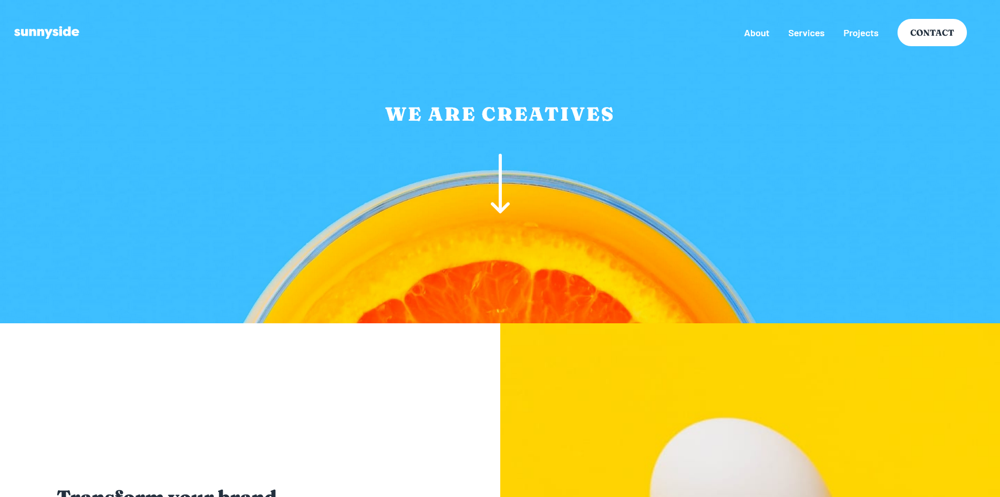

# Frontend Mentor - Sunnyside agency landing page solution

This is a solution to the [Sunnyside agency landing page challenge on Frontend Mentor](https://www.frontendmentor.io/challenges/sunnyside-agency-landing-page-7yVs3B6ef). Frontend Mentor challenges help you improve your coding skills by building realistic projects.

## Table of contents

- [Overview](#overview)
  - [The challenge](#the-challenge)
  - [Screenshot](#screenshot)
  - [Links](#links)
- [My process](#my-process)
  - [Built with](#built-with)
  - [What I learned](#what-i-learned)
- [Author](#author)

## Overview

### The challenge

Users should be able to:

- View the optimal layout for the site depending on their device's screen size
- See hover states for all interactive elements on the page

### Screenshot



### Links

- Solution URL: [Frontendmentor](https://www.frontendmentor.io/solutions/solution-using-sass-and-js-rkBo2axm9)
- Live Site URL: [Netlify](https://sunnyanton.netlify.app/)

## My process

### Built with

- HTML 5
- Sass
- Grid
- Flexbox
- Javascript

### What I learned

- I have learned how to change the color of a svg on hover.

```sass
  #footer-socials {
    img {
      transition: $hoverTransition;
    }
    a:hover img {
      filter: invert(100%) sepia(97%) saturate(0%) hue-rotate(251deg)
        brightness(101%) contrast(103%);
    }
  }
```

- I have learned how to change the images on a certain media with using js.

```JS
const mediaMedium = window.matchMedia("(min-width: 600px)");

if (mediaMedium.matches) {
  images.forEach((img) => (img.src = img.src.replace("mobile", "desktop")));
}
```

## Author

- Frontend Mentor - [@Nova988](https://www.frontendmentor.io/profile/Nova988)
- Github - [@Nova988](https://github.com/Nova988)
- Twitter - [@A_Nova988](https://twitter.com/A_Nova988)
